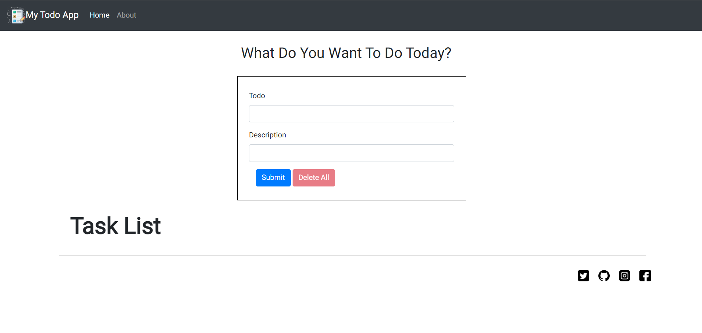

<!doctype html>
<html lang="en">
<head>
  <title>Todo Web App README</title>
  
</head>
<body>
  <h1>Todo Web App</h1>

  <h2>Overview</h2>
  
A simple Todo List web application built using HTML, CSS, and JavaScript. This app allows users to add, edit, delete, and view tasks they need to complete.

  <h2>Features</h2>
  <ul>
    <li><strong>Add Todo:</strong> Users can enter a title and description for their task and add it to the list.</li>
    <li><strong>Edit Todo:</strong> Users can edit existing todos directly from the list.</li>
    <li><strong>Delete Todo:</strong> Individual todos can be deleted by clicking on the delete button.</li>
    <li><strong>Delete All Todos:</strong> Users can delete all todos at once using the "Delete All" button.</li>
    <li><strong>Local Storage:</strong> Todos are stored in the browser's local storage, so they persist between sessions.</li>
    <li><strong>Responsive Design:</strong> The app is designed to work well on various screen sizes.</li>
  </ul>

  <h2>Technologies Used</h2>
  <ul>
    <li><strong>HTML:</strong> Structure and basic content of the web app.</li>
    <li><strong>CSS:</strong> Styling for layout and design.</li>
    <li><strong>JavaScript:</strong> Functionality for adding, editing, deleting todos, and interacting with local storage.</li>
    <li><strong>Bootstrap:</strong> Used for some styling and responsive design components.</li>
  </ul>

  <h2>How to Use</h2>
  <ol>
    <li><strong>Adding a Todo:</strong> Fill out the "Title" and "Description" fields in the form and click "Submit".</li>
    <li><strong>Editing a Todo:</strong> Click on the "Edit" button next to a todo, make changes in the input fields, and click "Update".</li>
    <li><strong>Deleting a Todo:</strong> Click on the "Delete" button next to a todo to remove it from the list.</li>
    <li><strong>Deleting All Todos:</strong> Click the "Delete All" button to remove all todos from the list.</li>
    <li><strong>Viewing Todos:</strong> Existing todos are displayed in a responsive card layout.</li>
  </ol>

  

  <h2>Future Improvements</h2>
  <ul>
    <li>Implement user authentication to save todos per user.</li>
    <li>Add search and filter functionalities for todos.</li>
    <li>Improve UI/UX with animations and more responsive design elements.</li>
  </ul>

  <h2>Contributions</h2>
  
Contributions are welcome! If you find any bugs or want to improve the app, feel free to fork the repository and submit a pull request.

  <h2>Author</h2>
  
<a href="https://github.com/84Chirag">Chirag Gour</a>

</body>
</html>
